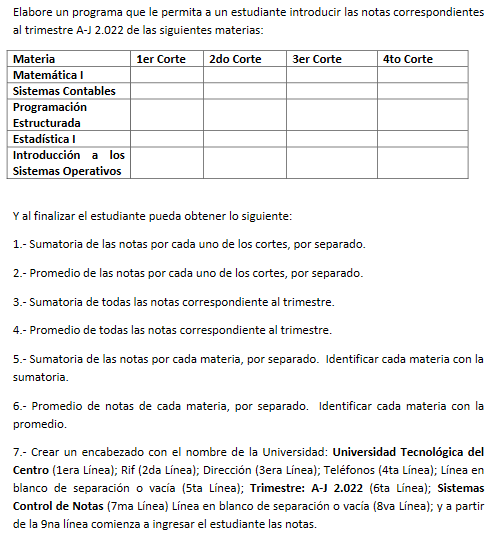

En esta ocasión tuve la oportunidad de programar en c# para una tarea de la universidad. Fue una experiencia bastante particular ya que a diferencia de JavaScript o Python, el manejo de datos en C# es más estricto (lo que puede representar un dolor de cabeza para algunas personas jejeje).

En este caso tenia que hacer una tarea sencilla creando un control de notas las instrucciones eran las siguientes:

Por ultimo tuve que grabar un video donde explico como lo programe y la logica. Aca abajo podras apreciarlo y ver un poco más como fue la experiencia.

<iframe width="560" height="315" src="https://www.youtube.com/embed/nc2eAqBFC48" title="YouTube video player" frameborder="0" allow="accelerometer; autoplay; clipboard-write; encrypted-media; gyroscope; picture-in-picture" allowfullscreen></iframe>