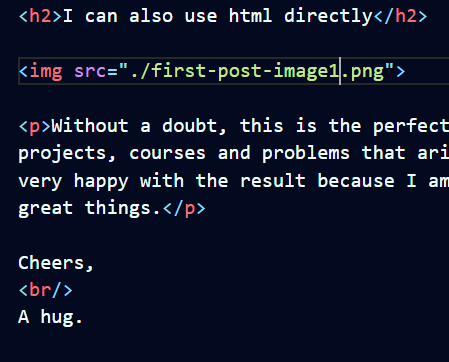

Title as: `print("inline code")`

I'm very excited as I was able to implement a complete, functional and responsive website using the knowledge I have been acquiring during the last three months. The truth is that I am amazed at how powerful and useful tools like Gatsby, React and Markdown can be. As Aristotle would say: "the more I see that I learn, the more I realize what I don't know" (I'm not sure if they were exactly his words, but something like that he said hehehe)

## Code block test

```css
.AClassCss .Subtitle {
  codecss: -0.5rem 0 0 0;
  morecodecss: 700;
}

.AnotherClass p {
  font-size: 1.125rem;
  margin-bottom: 2rem;
}

@media (max-width: 768px) {
  .AClass {
    flex-direction: column;
  }
}
```

As you can see, **in this same Markdown file I inserted a block of code** (in this case css) without any problem. This allows a lot of flexibility when wanting to document some programming work or any problem that has arisen when developing a project.

<h2>I can also use html directly</h2>



<p>Without a doubt, this is the perfect place to start documenting my projects, courses and problems that arise in my path as a web developer. I am very happy with the result because I am aware that it is the beginning of great things.</p>

Cheers,
<br/>
A hug.
